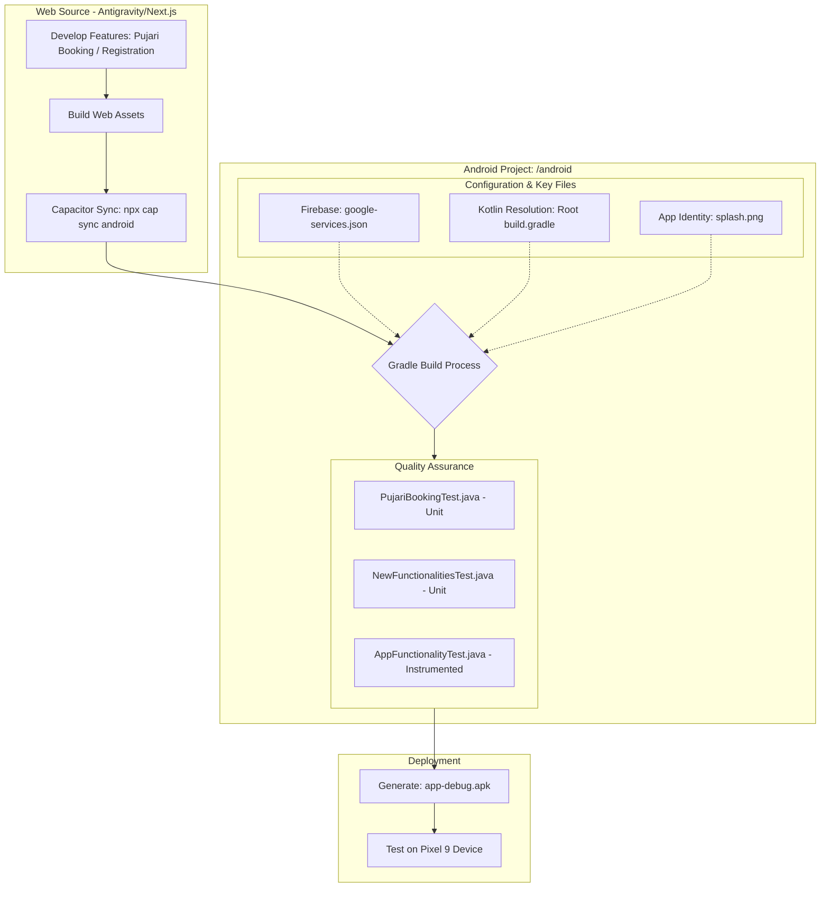

# Project Architecture & Functional Flow

This document provides a high-level overview of the **Capacitor Android** project structure and the testing/build lifecycle for the **Pantulugaru Devotional App**.

## 1. Project Overview
The project is an Android application built using Capacitor, which bridges a web-based frontend (Antigravity/Next.js) with native Android capabilities.

### Modules:
- **`:app`**: The main Android application module.
- **`:capacitor-android`**: The core Capacitor library.
- **`:capacitor-cordova-android-plugins`**: Support for Cordova plugins.

---

## 2. Functional Diagram (High-Level)

---

## 3. Key Components & Implementation Details

### A. Dependency Management
To resolve duplicate class errors (`kotlin-stdlib`), a **resolution strategy** was added to the root `build.gradle` to force all Kotlin dependencies to version **1.8.22**.

### B. Business Logic Testing
We implemented robust unit tests to verify core functionalities without needing a physical device:
- **`PujariBookingTest.java`**: Covers registration, profile updates, and booking lifecycles.
- **`NewFunctionalitiesTest.java`**: Covers availability checks, payment verification, and notification preferences.

### C. App Identity & Resources
- **Icon/Logo**: The app uses `splash.png` as its primary visual identity.
- **Firebase**: Native integration is enabled via `google-services.json` located in the `app/` directory.

---

## 4. Maintenance & Syncing
1. After making changes to the web frontend, run `npx cap sync android`.
2. To run logic tests: Right-click the `test` folder in Android Studio and select **Run 'Tests'**.
3. To generate a fresh test APK: Use **Build > Build Bundle(s) / APK(s) > Build APK(s)**.

---
*Last Updated: April 2024*
